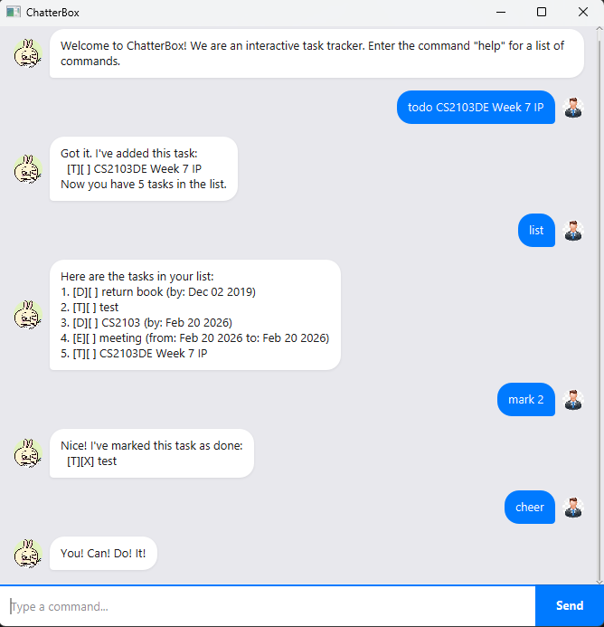

# ChatterBox User Guide

ChatterBox is a **desktop task management chatbot** that helps you track your todos, deadlines, and events through a simple chat interface. It is optimized for fast typists who prefer a Command Line Interface (CLI) while still enjoying the benefits of a Graphical User Interface (GUI).



---

## Table of Contents

- [Quick Start](#quick-start)
- [Features](#features)
  - [Viewing help: `help`](#viewing-help-help)
  - [Adding a todo: `todo`](#adding-a-todo-todo)
  - [Adding a deadline: `deadline`](#adding-a-deadline-deadline)
  - [Adding an event: `event`](#adding-an-event-event)
  - [Listing all tasks: `list`](#listing-all-tasks-list)
  - [Marking a task as done: `mark`](#marking-a-task-as-done-mark)
  - [Marking a task as not done: `unmark`](#marking-a-task-as-not-done-unmark)
  - [Deleting a task: `delete`](#deleting-a-task-delete)
  - [Finding tasks by keyword: `find`](#finding-tasks-by-keyword-find)
  - [Getting a motivational message: `cheer`](#getting-a-motivational-message-cheer)
  - [Exiting the application: `bye`](#exiting-the-application-bye)
- [Data Storage](#data-storage)
- [Date Format](#date-format)
- [FAQ](#faq)
- [Command Summary](#command-summary)

---

## Quick Start

1. Ensure you have **Java 21** or above installed on your computer.

2. Download the latest `chatterbox.jar` from the [releases page](https://github.com/siaoarh/ip/releases).

3. Copy the file to the folder you want to use as the home folder for ChatterBox.

4. Open a command terminal, `cd` into the folder you placed the JAR file in, and run:
   ```
   java -jar chatterbox.jar
   ```
   A GUI window should appear with a welcome message from ChatterBox.

5. Type a command in the text field at the bottom and press **Enter** (or click **Send**) to execute it.

6. Refer to the [Features](#features) section below for details on each command.

---

## Features

> **Notes about the command format:**
> - Words in `UPPER_CASE` are parameters to be supplied by the user.
>   e.g., in `todo DESCRIPTION`, `DESCRIPTION` is a parameter: `todo Buy groceries`.
> - Commands are **case-sensitive** and should be typed in lowercase.
> - Extraneous parameters for commands that do not take in parameters (such as `list`, `cheer`, `help`, `bye`) will be treated as unknown commands.

---

### Viewing help: `help`

Displays a list of all available commands and their usage.

**Format:** `help`

**Expected output:**
```
ChatterBox Help Guide

ChatterBox helps you manage and track your tasks.

Available commands:

list
    Displays all tasks.

todo <description>
    Adds a todo task.

deadline <description> /by <date>
    Adds a deadline task.
...
```

---

### Adding a todo: `todo`

Adds a simple task with no date attached.

**Format:** `todo DESCRIPTION`

**Example:**
```
todo Buy groceries
```

**Expected output:**
```
Got it. I've added this task:
  [T][ ] Buy groceries
Now you have 1 tasks in the list.
```

---

### Adding a deadline: `deadline`

Adds a task with a specific due date.

**Format:** `deadline DESCRIPTION /by DATE`

**Examples:**
```
deadline Submit report /by 2026-03-15
deadline CS2103 assignment /by 2026-03-20 2359
```

**Expected output:**
```
Got it. I've added this task:
  [D][ ] Submit report (by: Mar 15 2026)
Now you have 2 tasks in the list.
```

> [!NOTE]
> See the [Date Format](#date-format) section for accepted date formats.

---

### Adding an event: `event`

Adds a task with a start and end date/time.

**Format:** `event DESCRIPTION /from START_DATE /to END_DATE`

**Example:**
```
event Team meeting /from 2026-03-10 1400 /to 2026-03-10 1600
```

**Expected output:**
```
Got it. I've added this task:
  [E][ ] Team meeting (from: Mar 10 2026 to: Mar 10 2026)
Now you have 3 tasks in the list.
```

> [!NOTE]
> Both `/from` and `/to` dates are required. See the [Date Format](#date-format) section for accepted formats.

---

### Listing all tasks: `list`

Displays all tasks currently stored.

**Format:** `list`

**Expected output:**
```
Here are the tasks in your list:
1. [T][ ] Buy groceries
2. [D][ ] Submit report (by: Mar 15 2026)
3. [E][ ] Team meeting (from: Mar 10 2026 to: Mar 10 2026)
```

If there are no tasks:
```
You have no tasks in your list.
```

---

### Marking a task as done: `mark`

Marks the specified task as completed.

**Format:** `mark INDEX`

- `INDEX` refers to the task number shown in the `list` command.
- The index **must be a positive integer** (1, 2, 3, …).

**Example:**
```
mark 1
```

**Expected output:**
```
Nice! I've marked this task as done:
  [T][X] Buy groceries
```

---

### Marking a task as not done: `unmark`

Marks the specified task as not yet completed.

**Format:** `unmark INDEX`

**Example:**
```
unmark 1
```

**Expected output:**
```
OK, I've marked this task as not done yet:
  [T][ ] Buy groceries
```

---

### Deleting a task: `delete`

Removes the specified task from the list.

**Format:** `delete INDEX`

- `INDEX` refers to the task number shown in the `list` command.
- The index **must be a positive integer** (1, 2, 3, …).

**Example:**
```
delete 2
```

**Expected output:**
```
Noted. I've removed this task:
  [D][ ] Submit report (by: Mar 15 2026)
Now you have 2 tasks in the list.
```

---

### Finding tasks by keyword: `find`

Finds all tasks whose descriptions contain the given keyword. The search is **case-insensitive**.

**Format:** `find KEYWORD`

**Example:**
```
find meeting
```

**Expected output:**
```
Here are the matching tasks:
1. [E][ ] Team meeting (from: Mar 10 2026 to: Mar 10 2026)
```

If no tasks match:
```
No matching tasks found.
```

---

### Getting a motivational message: `cheer`

Displays an encouraging message to keep you going!

**Format:** `cheer`

**Expected output:**
```
You! Can! Do! It!
```

---

### Exiting the application: `bye`

Exits the application. The window will close automatically.

**Format:** `bye`

**Expected output:**
```
Bye. Hope to see you again soon!
```

---

## Data Storage

- Task data is automatically saved to `data/duke.txt` in the same directory as the application after every command that modifies tasks (add, delete, mark, unmark).
- There is **no need to save manually**.
- The data file is created automatically if it does not exist.

> [!CAUTION]
> If you edit the data file manually and the format becomes invalid, corrupted entries will be skipped when the application loads. It is recommended to back up the file before making manual edits.

**Data file format:**
```
T | 0 | Buy groceries
D | 0 | Submit report | 2026-03-15T00:00
E | 1 | Team meeting | 2026-03-10T14:00 | 2026-03-10T16:00
```

- `T`, `D`, `E` represent Todo, Deadline, and Event respectively.
- `0` = not done, `1` = done.
- Fields are separated by ` | `.

---

## Date Format

ChatterBox accepts the following date formats:

| Format | Example | Description |
|---|---|---|
| `yyyy-MM-dd` | `2026-03-15` | Date only (time defaults to 00:00) |
| `yyyy-MM-dd HHmm` | `2026-03-15 2359` | Date with time in 24-hour format |

Dates are displayed in `MMM dd yyyy` format (e.g., `Mar 15 2026`).

> [!IMPORTANT]
> If an invalid date format is provided, ChatterBox will display an error message: *"Hello! Please use yyyy-MM-dd or yyyy-MM-dd HHmm for dates."*

---

## FAQ

**Q: How do I transfer my data to another computer?**\
A: Copy the `data/duke.txt` file from your current ChatterBox home folder to the same location on the other computer.

**Q: Is there a limit to how many tasks I can add?**\
A: ChatterBox supports up to 100 tasks.

**Q: Can I use ChatterBox without the GUI?**\
A: ChatterBox is designed as a GUI application. The legacy CLI mode is no longer actively maintained.

**Q: What happens if I type an unrecognized command?**\
A: ChatterBox will display an error message: *"Hello! I'm sorry, but I don't know what that means. Please try again."*

---

## Command Summary

| Command | Format | Example |
|---|---|---|
| **Help** | `help` | `help` |
| **Todo** | `todo DESCRIPTION` | `todo Buy groceries` |
| **Deadline** | `deadline DESCRIPTION /by DATE` | `deadline Submit report /by 2026-03-15` |
| **Event** | `event DESCRIPTION /from DATE /to DATE` | `event Meeting /from 2026-03-10 1400 /to 2026-03-10 1600` |
| **List** | `list` | `list` |
| **Mark** | `mark INDEX` | `mark 1` |
| **Unmark** | `unmark INDEX` | `unmark 1` |
| **Delete** | `delete INDEX` | `delete 2` |
| **Find** | `find KEYWORD` | `find meeting` |
| **Cheer** | `cheer` | `cheer` |
| **Bye** | `bye` | `bye` |